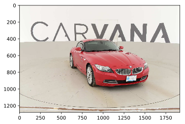

Just small machine vision project
=================================
Challenge to develop an algorithm that automatically removes the photo studio background on [Carvana](https://www.kaggle.com/c/carvana-image-masking-challenge) Kaggle competition. It uses original convolutional network [U-Net](https://arxiv.org/abs/1505.04597) with some image preprocessing. And in general, it works.

We have 5088 images, 318 cars with 16 views each, and its labeled masks.

Cars are scaled in 4 times for width and height from 1280x1918 to 320x480 resolution. Color channels are averaged to one gray channel. It allows to use 4 * 4 * 3 = 48 times more GPU memory at model training. Of course, we lose a little bit of quality when rescale trained masks back to 1280x1918, but get much more improvement in the network inference. Experiments shows, that grayscale images gain more quality than color. I think, it's becouse used in three times more convolutional layers with the same memory. Images are standartized to normal distribution with zero mean and variation, equal to one.

Network was trained by NVIDIA Tesla K80 with 12gb video memory. Tesla was rented on [floydhub](https://www.floydhub.com/) server. Optimization algorithm uses Adam background. As loss function is implemented bce dice loss. It just divided by two [binary cross entropy](https://stats.stackexchange.com/questions/260505/machine-learning-should-i-use-a-categorical-cross-entropy-or-binary-cross-entro) with substracted [dice coefficient](https://en.wikipedia.org/wiki/S%C3%B8rensen%E2%80%93Dice_coefficient). Model is trained 5 epochs about 2 hours, seen 25440 images and has close to one accuracy. Implementation has the important technical detail, that images upload as batch at runtime from hard drive. For each stochastic gradien descent calculation. It's great to save main memory and there is no loss of speed becouse of CPU and GPU are working in parallel.

 

Test sample has 100064 images of 6254 cars. Here you may see results of the work.

	
