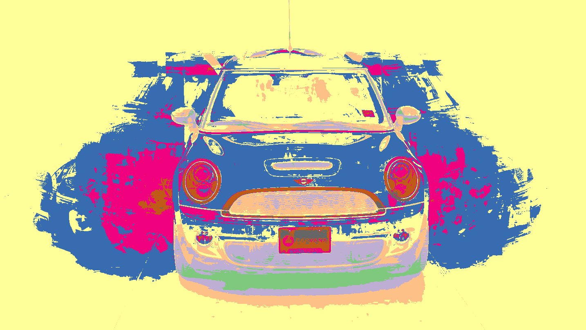
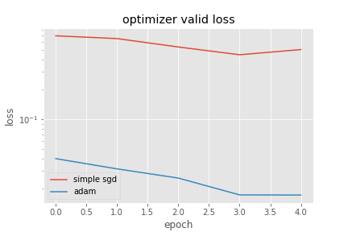
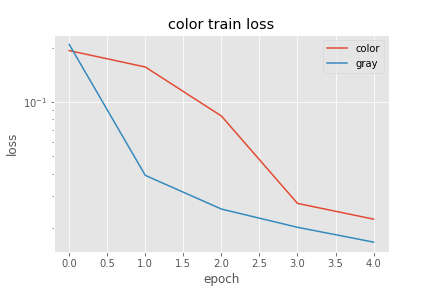
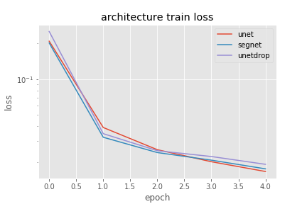
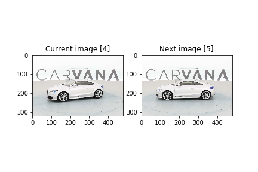
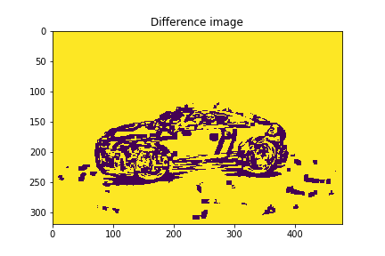
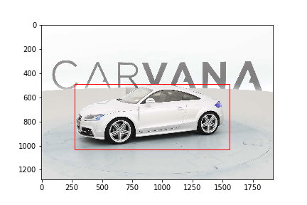
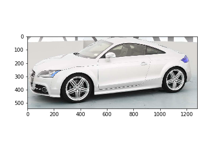
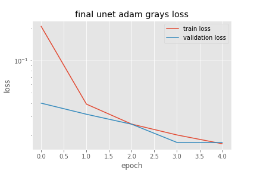
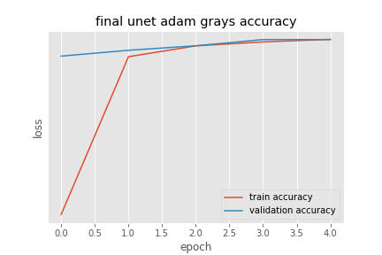

Just small cnn machine vision project
=====================================

Statements
==========

> Challenge to develop an algorithm, that automatically removes the photo studio background on [Carvana](https://www.kaggle.com/c/carvana-image-masking-challenge) Kaggle competition. It uses the original convolutional network [U-Net](https://arxiv.org/abs/1505.04597) with some images preprocessing. And in general, it works.

> We have 5088 images, 318 cars with 16 views each, and its labeled masks.

> Cars images are scaled in 4 times for width and height from 1280x1918 to 320x480 resolution. Color channels are averaged to one gray channel. It allows to use 4 * 4 * 3 = 48 times more GPU memory at model training. Of course, we lose a little bit of quality when rescale trained masks back to 1280x1918, but get much more improvement in the network inference. Experiments below show, that grayscale images gain more quality than colors. Images are standardized to normal distribution with zero mean and unit variation.

Experiments
===========

> Network was trained by GPU NVIDIA Tesla K80 with 12gb video memory. Tesla was rented on [floydhub](https://www.floydhub.com/) server. In all experiments model was trained 5 epochs on 16-sized bathces about one hour and seen 25440 images. Batches were formed absolutely randomly from train sample. Implementation has the important technical detail, that images upload as batch at runtime from hard drive for each stochastic gradient descent calculation. It's great to save main memory, and there is no loss of speed, because of CPU and GPU are working in parallel.

> As loss function bce dice loss is implemented. It is just divided by two [binary cross entropy](https://stats.stackexchange.com/questions/260505/machine-learning-should-i-use-a-categorical-cross-entropy-or-binary-cross-entro) with subtracted [dice coefficient](https://en.wikipedia.org/wiki/S%C3%B8rensen%E2%80%93Dice_coefficient). This is worked well on last competition of [ultrasound nerve segmengtation](https://www.kaggle.com/c/ultrasound-nerve-segmentation). Cross entropy is a theoretically proved loss: it is maximum likelihood for bernoulli distribution, which we have in our binary segmentation task. Next, dice coefficient, is a competition metric, which we can include in our loss for better competition solution.

> As optimization algorithm was taken adam. Other algorithms like simple sgd were converged too slow, either didn't converged at all (like adagrad).

> As was said, grayscales are preferred then colors. It is not obvious, however at first 4 epochs grayscales show better result. Furthermore, optimization of color crushes after 4 epoch. Was trying decay learning rate, but convergence becoming really slow, and there is no guarantee, that will be better.

> Further, I was choosing between segnet and unet architecture. And trying to implement dropout layers in unet after input and convolution layers. Experiments show, that unet without dropout is the best for the task. There is a simple explanation: unet is just modified segnet, where, in general, convolutional layers in addition to direct connection are concatenated symmetrically. This enables to provide more information, without adding new parameters, which can overfit model. Next, dropout layers are not always a good thing for fully convolutional, in comparison to fully connected. Because of the first have much less parameters to drop, and kernel weights compute over all image and have strong correlation. The exclusion of some can degrade the quality. Also, unet has trainable upsample layers. In original segnet images are upsampled by bilinear interpolation.

In progress
===========
> It will be good to experiment with convolutional [strides](http://deeplearning.net/software/theano/tutorial/conv_arithmetic.html) instead of classical max-polling. The model should be much faster, but I'm not sure, that will not lose in quality due to noise. Also, it worth to try scaling full sized images by neuralnetwork itself, instead of scaling their before training and rescaling after predict.

> One car in train and test sample is represented in 16 rotation views. Thus, we have a simple time series. I've been thinking how to use it, because when training model, we can't use this information. Convolutional network should be trained stochastic to avoid overfitting. But recently I find the [answer](https://www.kaggle.com/alekseit/simple-bounding-boxes) on Kaggle. Main idea, that we can differentiate time series and find segmentation box without any machine learning. It's cool preprocessing. Author wrote, "It allowed me to get to the top 5. I save the bounding boxes for train and test, and then crop on the fly. When making a prediction, I do it for the cropped mask, and then just append zeros so, that it matches the original image size."

Decision
========
> In the end it was decided to implement unet with adam and grayscale images. It achieves 0.993/0.993 accuracy, 0.016/0.017 bce loss and 0.988/0.989 dice coefficient on train/valid. 

 

> Test sample has 100064 images of 6254 cars. Here you may see results of the work. All test cars will be rendered a little over a week by my VAIO. I'll submit predictions on Kaggle and write about it later. The leader of competition now has got 0.997 dice coefficient.

